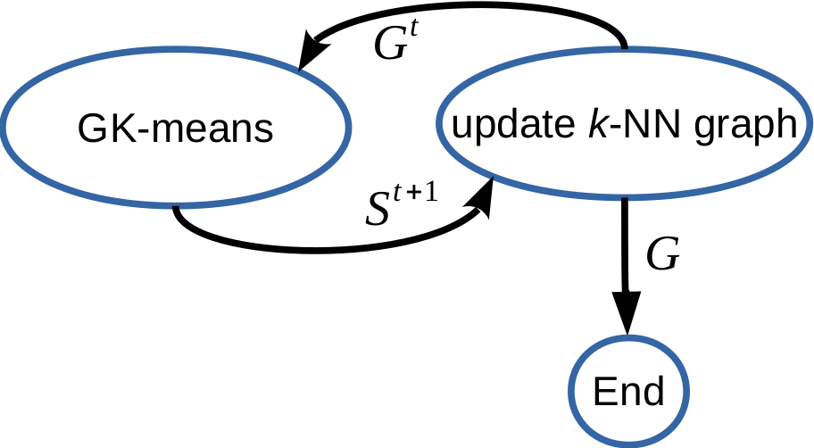

# Fast K-means Based on k-NN Graph


## **Introduction**

GK-means is the source code of ICDE 2018 paper[[WlZhao18](#References)]. It is a new algorithm to accelerate
large-scale data clustering with little drop in clustering quality.

 <p align="center">
 
 </p>


## **How it works**
The proposed fast k-means consists of two major steps. In the first step, the fast k-means is called τ times to build an approximate k-NN graph for itself. In the second step, the fast k-means is performed again to produce k clusters with the support of the approximate k-NN graph G. Since the k-NN graph is built based on the intermediate clustering results in the first step, the information that how the samples are organized as clusters is kept with the k-NN graph. The clustering in the second step is therefore guided by such kind of “prior knowledge”. Since this algorithm is based on k-NN graph, it is called as graph based k-means (GK-means).


## Compilation

* The codes should be compiled with -std=c++11  or later. 

## Run
To run the GK-means, user is recommended to call "test()" function in "main.cpp". Dataset SIFT100K is attached with this package.


## **References**
Please cite gkmean in your publications if it helps your research:
```
@inproceedings{WlZhao18,
  author    = {Chenghao Deng and
               Wanlei Zhao},
  title     = {Fast k-Means Based on k-NN Graph},
  booktitle = {2018 IEEE 34th International Conference on Data Engineering (ICDE)},
  pages     = {1220-1223},
  year      = {2018}
}


## Contribute
This project welcomes contributions and suggestions from all the users.

We use GitHub issues for tracking suggestions and bugs.


## Author
Author: Wan-Lei Zhao
```
Date: May.-6-2020
